Web inventaris barang kantor 

Fitur:

1.user login berdasrkan role

2.admin kelola barang

3.admin kelola kategori

4.admin kelola karyawan

5.admin validasi peminjaman barang

6.karyawan dapat meminjam berdasrkan stok yang tersedia

7.karyawan dapat mengembalikan barang jika sudah selesai

8.Dark mode

9. Mini AI
&nbsp;

Akun Demo

1.Admin | Username : admin@gmail.com Pw : 123
2.Karyawan | Username : alex@gmail.com Pw : 123

&nbsp;

Alur Admin:

1.CRUD kategori barang 

2.CRUD barang berdasarkan kategori barang 

3.CRUD akun karyawan 

4.lihat peminjaman

5.CRUD Validasi peminjaman karyawan

&nbsp;

Alur Karyawan :

1.Lihat barang yang tersedia

2.Pinjam barang

3.Tunggu validasi admin

4.Barang dapat dipinjam jika sudah di validasi admin

5.Kembalikan barang jika sudah selesai

6.Klik kembalikan pada halaman peminjaman

&nbsp;

1.VS Code 

2.Xampp

3.MySQL

4.PHP

5.HTML

6.CSS

7.Boostrap

&nbsp;

Berikut adalah tampilan web

1. Halaman Utama

2. Halaman utama 
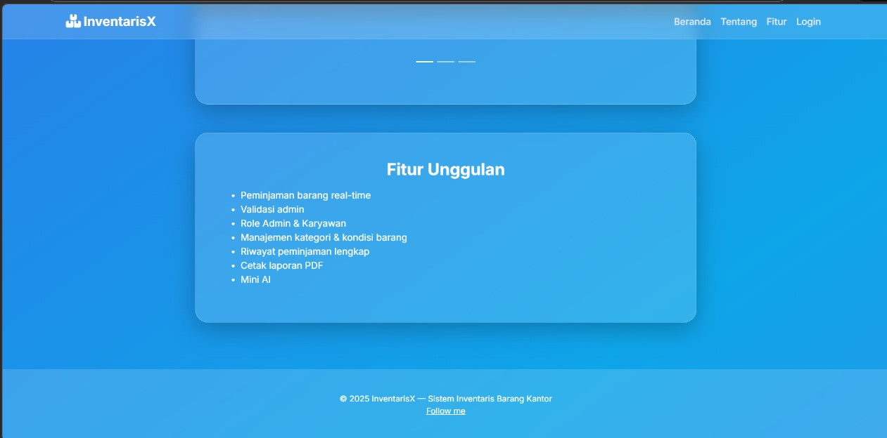

3. Halaman login
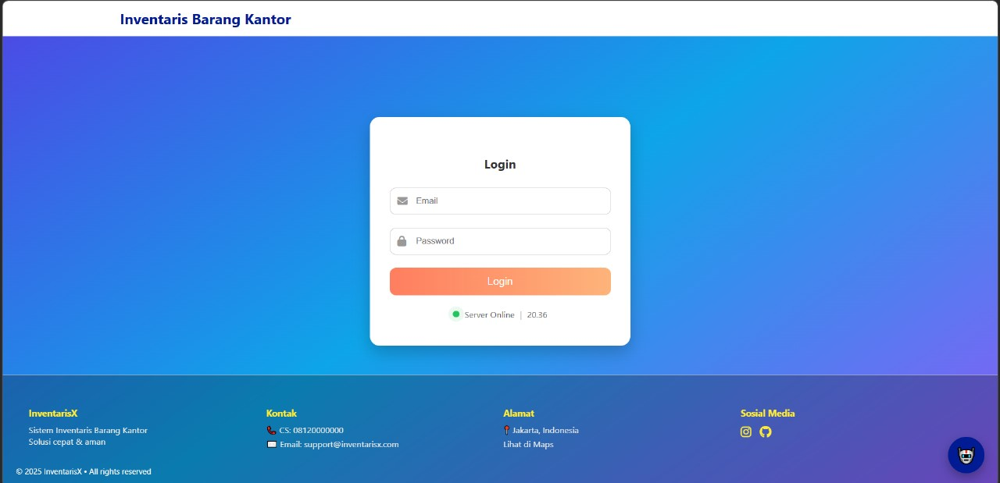

4. Halaman tambah login & mini AI

5. Halaman dashboard admin
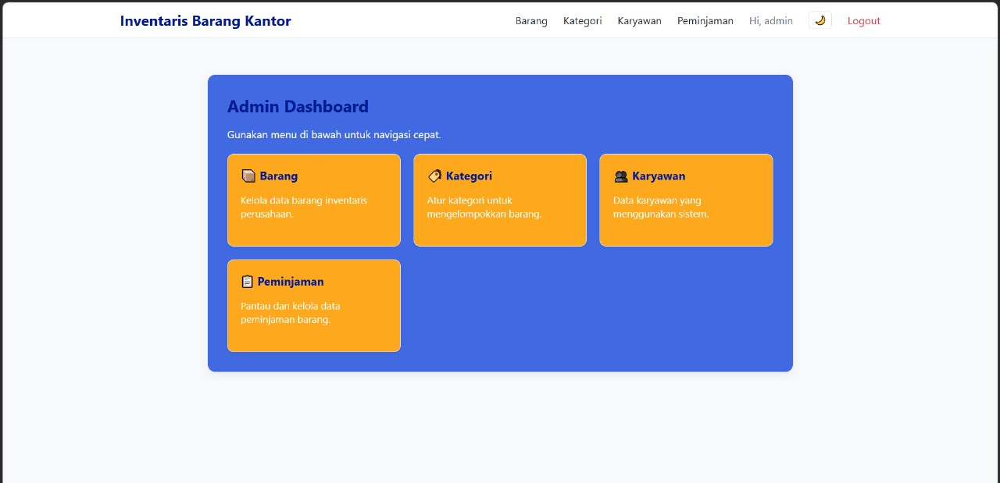

6.Halaman Kategori
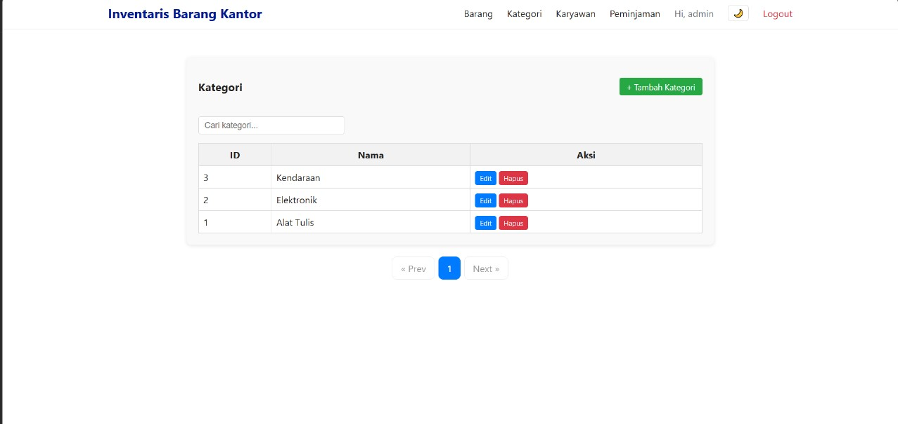

7.Halaman Tambah Kategori
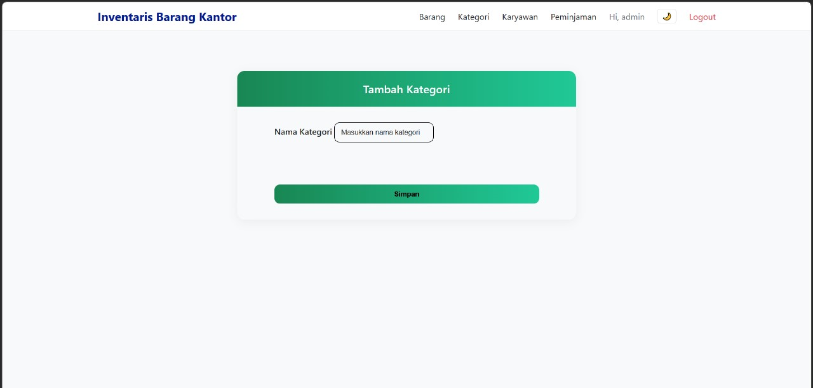

8.Halaman Barang
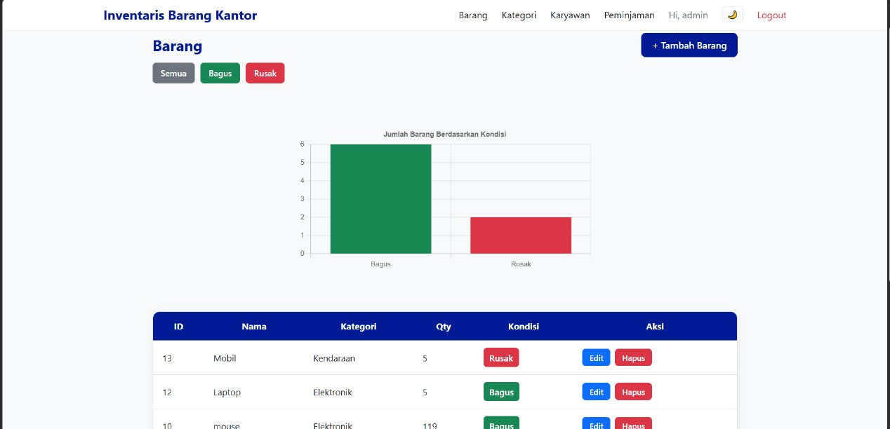

9.Halaman tambah barang
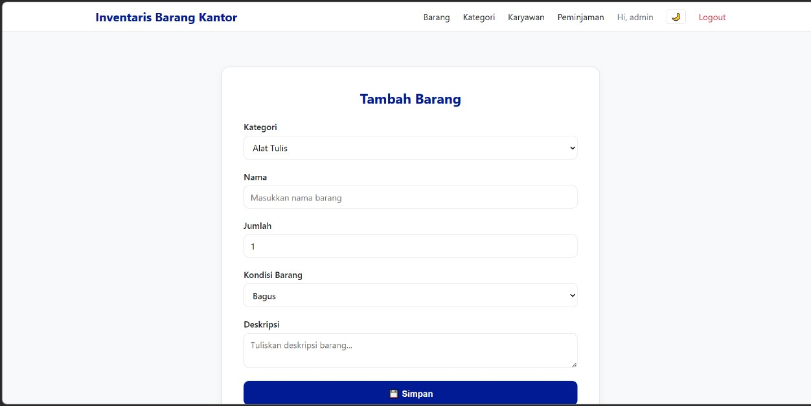

10.Halaman data karyawan
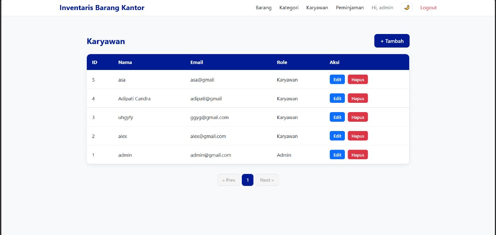

11.Halaman data peminjaman
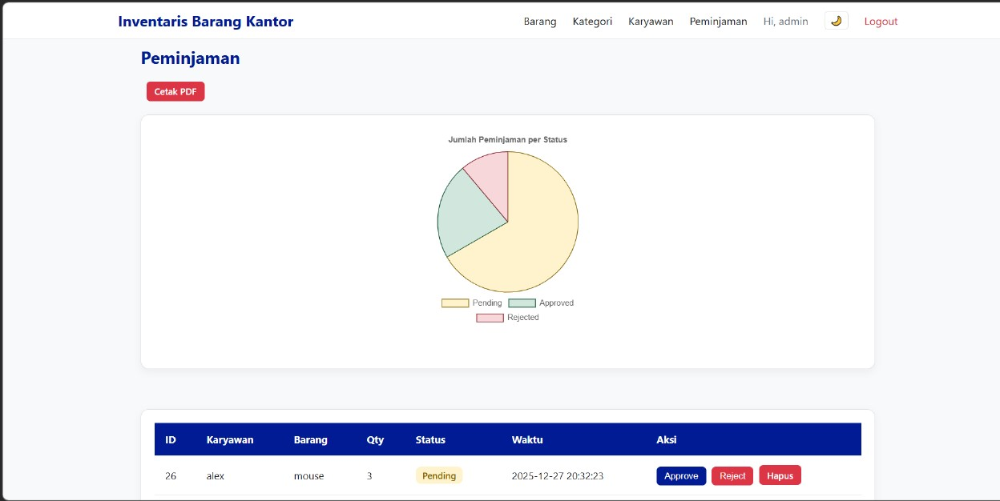

12.halaman hasil cetak pdf
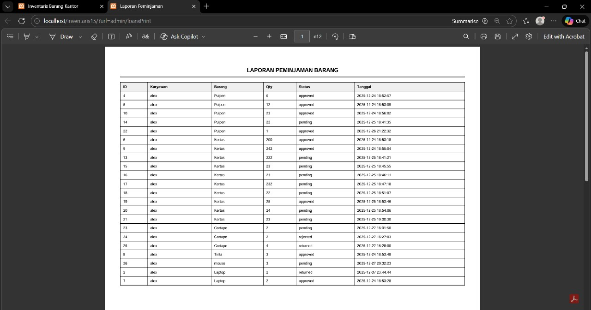

13.Dark mode
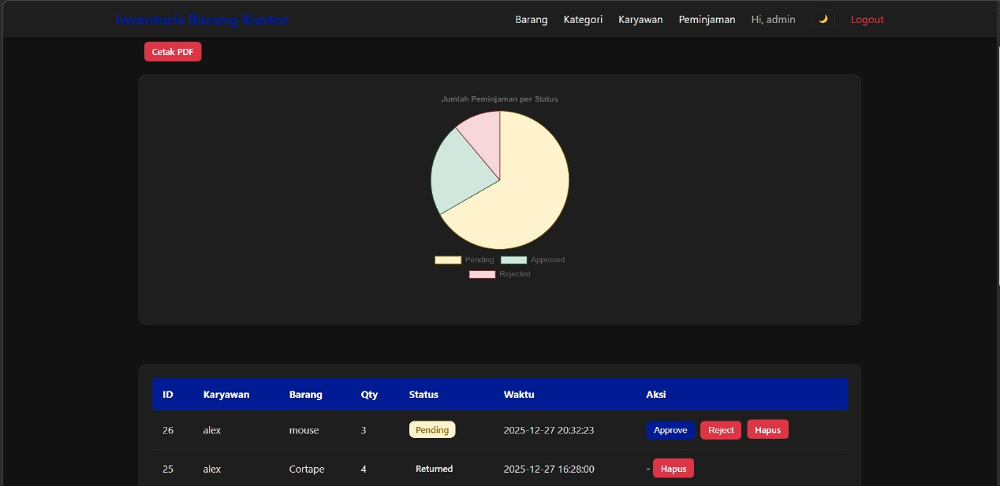

14.Dashboard Karyawan
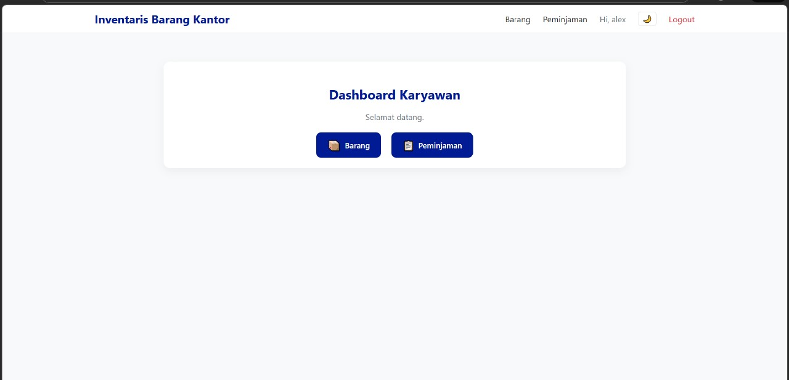

15.Daftar barang halaman karyawan dan peminjaman
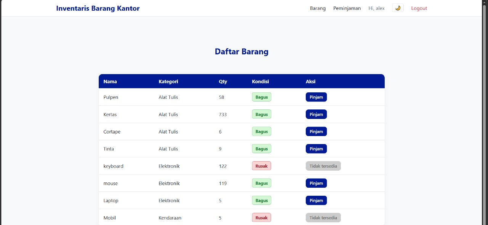

16.Halaman status peminjaman 

